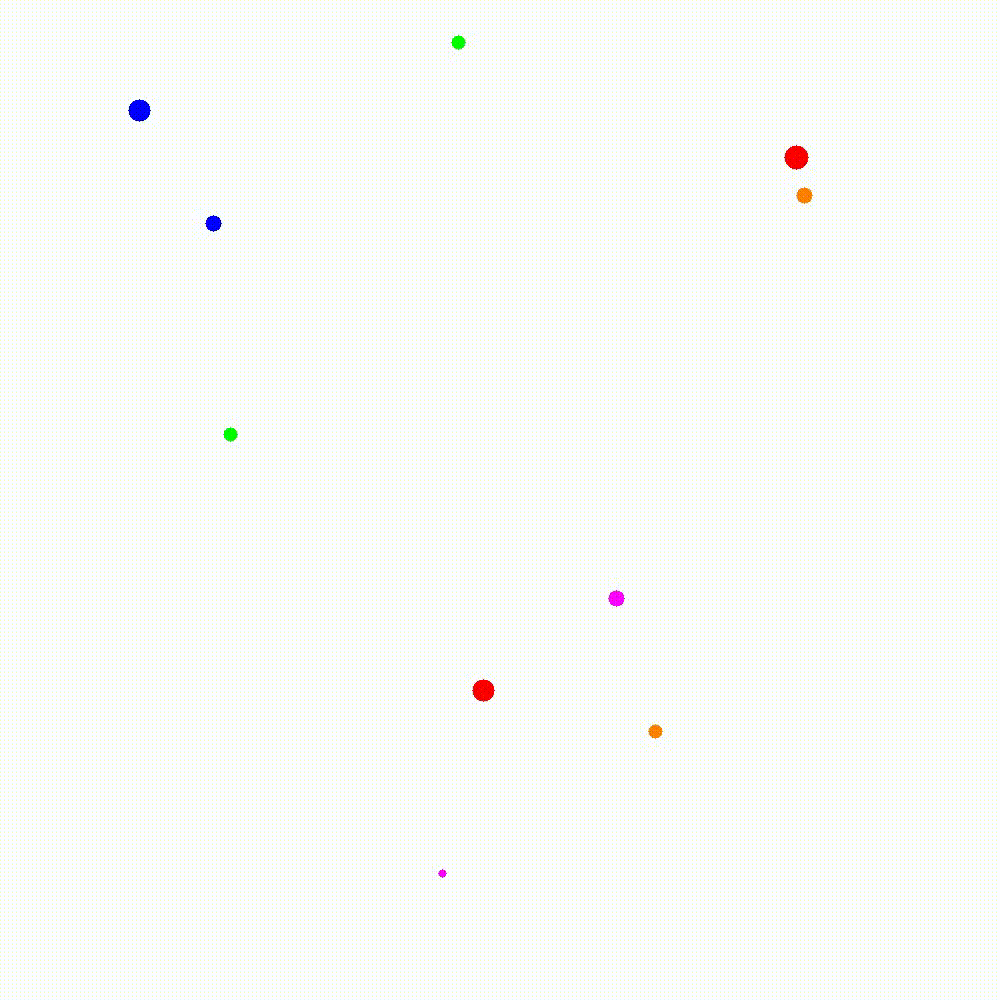

# Performance types of structures C++ analysis
Analyze optimization in a C++ code using different types of structures. These structures are discussed below:
1. `aos`: Array of Structures
2. `soa`: Structure of Arrays

The idea of this project is to analyze the performance of `aos` and `soa` structures in a C++ code simulating a problem of gravitational attraction between objects in three-dimensional space. The difference between between them is the way the objects are stored. The first one uses an array of structures while the second one uses an array structure. arrays.
<p align="center">
  
</p>


Furthermore, we also analyze the performace after parallelizing the code using `OpenMP`.

This project was made for the subject Computer Architecture of the Computer Engineering degree at the UC3M.

## Files Oveview
* `sim-aos.cpp`: C++ code using `aos` structure.
* `sim-soa.cpp`: C++ code using `soa` structure.
* `sim-paos.cpp`: C++ code using `aos` structure and parallelized with `OpenMP`.
* `sim-psoa.cpp`: C++ code using `soa` structure and parallelized with `OpenMP`.
* `sim-aos-opti.cpp`: C++ code using `aos` structure based on `sim-aos.cpp` but optimized. This file also include `OpenCV` library to generate a video with the simulation.
* `sim-soa-opti.cpp`: C++ code using `soa` structure based on `sim-soa.cpp` but optimized.
* `Makefile`: Makefile to compile the code.

## How to compile
To compile the code, you just need to run the following command:
```
make
```
**Note:** You need to have `OpenCV` installed in your computer to compile `sim-aos-opti.cpp` files.

## How to run
To run the code, you just need to run the following command:
```
./sim-<structure> <num_objects> <num_iterations> <random_seed> <size_enclosure> <time_step>
```
where:
* `structure`: `aos`, `soa`, `paos` or `psoa`.
* `num_objects`: Number of objects in the simulation.
* `num_iterations`: Number of iterations of the simulation.
* `random_seed`: Seed for the random number generator.
* `size_enclosure`: Size of the enclosure.
* `time_step`: Time step of the simulation.

Example:
```
./sim-aos-opti.o 10 2000 81 100000 0.1
```

The program will automatically generate a `init_config.txt` file with the initial configuration of the objects based on the random seed and a `final_config.txt` file with the final configuration of the objects.


## Authors
Alberto Maté Angulo
Samuel Halstead Aldea
Juan Franco Labarra
Hugo García Cuesta
